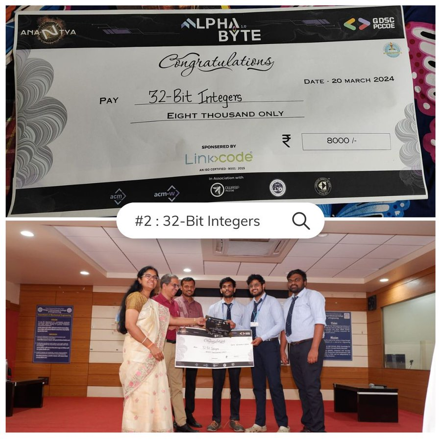

<h2>Hey <𝚌𝚘𝚍𝚎𝚛𝚜/>! 👋</h2>

  <b><i>Let's connect! Find me on the web.</i></b>

  
  <a href="https://www.linkedin.com/in/chetan-padhen-501416222/" target="_blank">  
  

## :zap: About Me 👦
- 👋 Hi, I'm a B.Tech Student of **Pimpri Chinchwad Collage Of Engineering** 🧑‍💻🎉
- 🔭 I’m currently working on my **Full Stack skills! The  Goal Is To increase Customers,Efficiency & Money** 💻🚀
- 🎊 I have a keen interest in **Full stack development** and I love developing softwares, websites, models, and web apps 🏈🎯
- 🎭 I'm always looking for new challenges and opportunities to learn and grow. I'm excited to share my work on **GitHub** and collaborate with others in the open source community 🎰♠️
- 📫 Whether you're interested in discussing potential collaborations, tech insights, or just want to say hi, you can contact me at padhenchetan@gmail.com. I'm always up for a good conversation! 📩👋

<!-- ---------------------------------------------------------------------------------------------------------------------------------------------------- -->

## :zap: Open Source Programs 🎭
<table align="center">
  <tr>
    <td style="border-right: 1px solid #eeeeef;" align="center"> 🌟 Contributor at   <a href="https://hacktoberfest.com/">Hacktoberfest'23</a> </td>
    <td style="border-right: 1px solid #eeeeef;" align="center"> 🚩 Contributor at   <a href="https://postimg.cc/jLVz3PkK">Code Peak'23</a> </td>
    </tr>
</table>

## :zap: Achievements 🏆
<table align="center">
  <tr>
    <td>Hacktoberfest'23</td>
    <td>
      
    </td>
  </tr>
  <tr>
    <td>Code Peak'23</td>
    <td>🏅 Ranked 40th With out of 500+ participants, Top 100.</td>
  </tr>
  <tr>
   <td>1st Runner Up In National Lavel Hackthon Alpha Byte</td>
    <td>
      
    </td>
  </tr>
</table>

</table>

<!-- ---------------------------------------------------------------------------------------------------------------------------------------------------- -->

## :zap: Connect with me ✍️

  <!-- LinkedIn -->
  
  <!-- X -->
  
   <!-- HashNode -->
  

## :zap: My CP Handles 🎯

  <!-- LeetCode -->
  
  <!-- CodeChef -->
  
   <!-- GeeksforGeeks -->
  

## :zap: Tools and Technologies ⛷️

  <!-- C -->
  
  <!-- C++ -->
  
  <!-- HTML5 -->
  
  <!-- CSS3 -->
  
  <!-- Bootstrap -->
  
  <!-- JavaScript -->
  
  <!-- React -->
  
  <!-- My SQL -->
  
  <!-- MongoDB -->
  
   <!-- ExpressJS -->
  
  <!-- NodeJS -->
  
    <!-- Git -->
  
  <!-- GitHub -->
  
  
<!-- ---------------------------------------------------------------------------------------------------------------------------------------------------- -->

